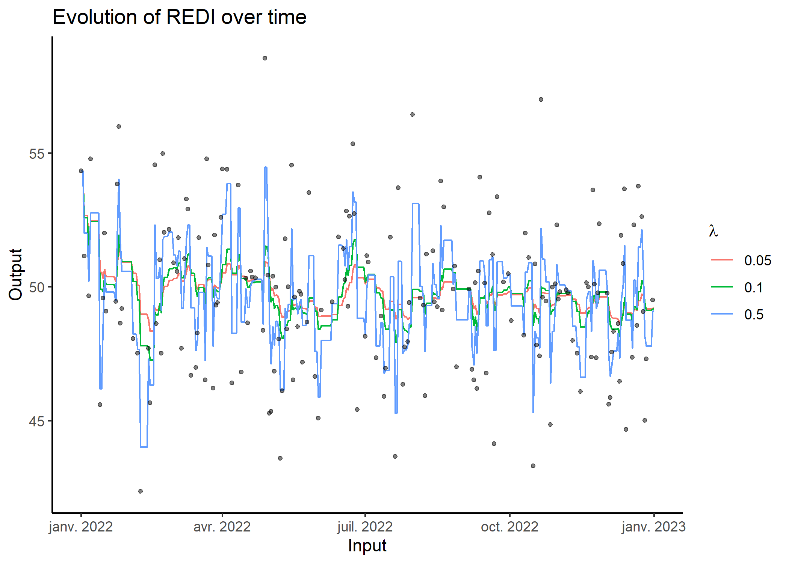
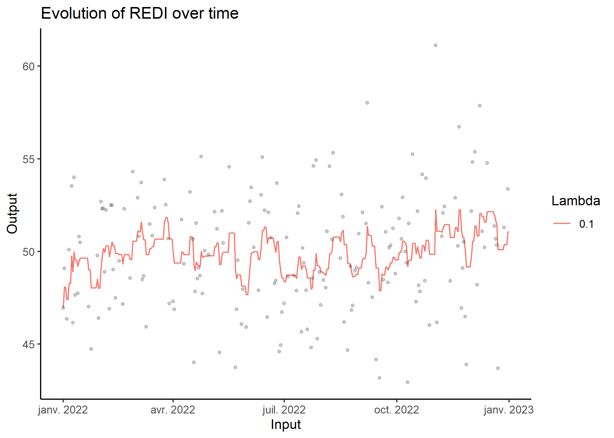
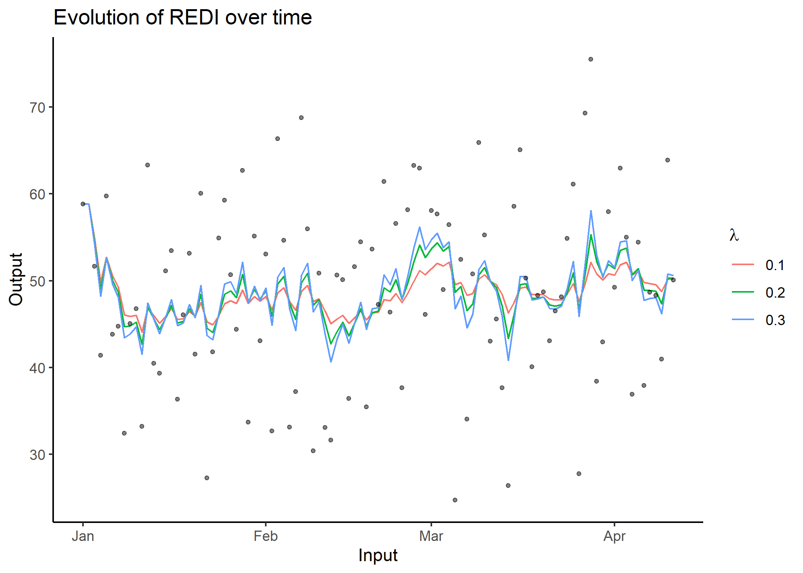

# REDI

<!-- badges: start -->
<!-- badges: end -->

The *REDI* package implements the Robust Exponential Decreasing Index
(REDI). It represents a measure of cumulated workload, is robust to
missing data and provides control of the decreasing influence of the
workload over time.

*REDI* provides various functions to format data, compute REDI and
visualise results in a simple and convenient way.

Issa Moussa, Arthur Leroy et al. (2019): Robust Exponential Decreasing
Index (REDI): adaptive and robust method for computing cumulated
workload. *BMJ Open Sport & Exercise Medicine*,
<https://bmjopensem.bmj.com/content/bmjosem/5/1/e000573.full.pdf>.

## Installation

You can install the development version of REDI from
[GitHub](https://github.com/) with:

``` r
#install.packages("devtools")
devtools::install_github("Grenouil/REDI")
```

## REDI in a nutshell

Here is a basic example on how to simulate a dataset with the adequate
format, compute REDI values over time and display results.

``` r
library(REDI)
set.seed(42)
## Generate a synthetic dataset with the correct format
data = simu_db()

data
#> # A tibble: 366 x 2
#>    Input      Output
#>    <date>      <dbl>
#>  1 2022-01-01   54.3
#>  2 2022-01-02   NA  
#>  3 2022-01-03   51.1
#>  4 2022-01-04   NA  
#>  5 2022-01-05   NA  
#>  6 2022-01-06   49.7
#>  7 2022-01-07   54.8
#>  8 2022-01-08   NA  
#>  9 2022-01-09   NA  
#> 10 2022-01-10   NA  
#> # i 356 more rows

## Compute REDI over all observations for different Lambda values and display results
res = redi(data)
```



``` r

res
#> # A tibble: 1,098 x 4
#>    Input      Output  REDI Lambda
#>    <date>      <dbl> <dbl>  <dbl>
#>  1 2023-01-01   NA    49.2   0.05
#>  2 2022-12-31   49.5  49.2   0.05
#>  3 2022-12-30   NA    49.2   0.05
#>  4 2022-12-29   NA    49.2   0.05
#>  5 2022-12-28   NA    49.2   0.05
#>  6 2022-12-27   47.3  49.2   0.05
#>  7 2022-12-26   45.0  49.3   0.05
#>  8 2022-12-25   49.1  49.7   0.05
#>  9 2022-12-24   52.6  49.7   0.05
#> 10 2022-12-23   NA    49.5   0.05
#> # i 1,088 more rows
```

## Detailed workflow

For a advanced use of the package, here is a quick step-by-step guide.

### Data simulation

In order to test different features of the package, the `simu_db()`
function is provided as a handy way to generate synthetic data with the
correct format for subsequent REDI computations.

``` r
set.seed(42)
## Generate a synthetic dataset, containing dates (Inputs) from '2022-01-01' to '2023-01-01' and observations (Outputs) following a Gaussian distribution (mean = 50, var = 10), with 50% of missing values.
simu_data <- simu_db(start_date = '2022-01-01',
    end_date = '2023-01-01',
    by = 'day',
    output_distrib = 'Gaussian',
    ratio_missing = 0.5,
    mean = 50,
    var = 10)

simu_data
#> # A tibble: 366 x 2
#>    Input      Output
#>    <date>      <dbl>
#>  1 2022-01-01   54.3
#>  2 2022-01-02   NA  
#>  3 2022-01-03   51.1
#>  4 2022-01-04   NA  
#>  5 2022-01-05   NA  
#>  6 2022-01-06   49.7
#>  7 2022-01-07   54.8
#>  8 2022-01-08   NA  
#>  9 2022-01-09   NA  
#> 10 2022-01-10   NA  
#> # i 356 more rows
```

As displayed above, any dataset processed in REDI should provide 2
columns: one corresponding to `Input` values (*e.g.* time) and another
to `Output` values (*e.g.* workload).

### Convert a dataset to the correct format with `format_data()`

However, a real-life dataset will generally not have the correct format
to compute REDI directy. Therefore, the `format_data()` function is
designed to help with this process by identifying the columns
corresponding to the Input (e.g the date) and the Output (e.g. the
workload) variables. The Input column should be defined with a correct
`Date` type. The function will automatically identify missing values
between each observations, considering the `by` argument as the time
increment (for instance with ‘day’, the default, each day between two
observed dates is considered missing). Finally, Output values for
duplicated Input values can be summarised according to the
`summarise_duplicate` argument.

``` r

## Create a dummy real-life dataset 
raw_db <- data.frame(
  'Var1' = 1:100, 
  'Var2' = rnorm(n = 100, mean = 50, sd = 10), 
  'Var3' = c(
    as.Date("2022/1/1"), 
    seq(from = as.Date("2022/1/3"), by = "day", length.out = 99)
    )
  )

head(raw_db)
#>   Var1     Var2       Var3
#> 1    1 58.84844 2022-01-01
#> 2    2 51.63431 2022-01-03
#> 3    3 41.39630 2022-01-04
#> 4    4 59.74555 2022-01-05
#> 5    5 43.81340 2022-01-06
#> 6    6 44.72518 2022-01-07

## Convert the dataset to the correct format (adding the missing data point on 2022-01-02) 
db <- format_data(
    data = raw_db,
    input = 'Var3',
    output = 'Var2',
    by = 'day',
    format = '%Y%m%d'
    )

db
#> # A tibble: 101 x 2
#>    Input      Output
#>    <date>      <dbl>
#>  1 2022-01-01   58.8
#>  2 2022-01-02   NA  
#>  3 2022-01-03   51.6
#>  4 2022-01-04   41.4
#>  5 2022-01-05   59.7
#>  6 2022-01-06   43.8
#>  7 2022-01-07   44.7
#>  8 2022-01-08   32.4
#>  9 2022-01-09   45.0
#> 10 2022-01-10   46.8
#> # i 91 more rows
```

### Computation of REDI with `compute_redi()`

To compute a single REDI value, simply use the `compute_redi()`
function. It will correspond to the REDI value for the most recent
observed Input in the dataset, using all data from the past. Feel free
to adapt the $\lambda$ coefficient, controlling the exponential decay of
weights over time, depending on the context.

``` r

## Compute REDI at the current date (2022-04-11 in this example)
compute_redi(db, coef = 0.05)
#> [1] 49.85942

max(db$Input)
#> [1] "2022-04-11"
```

### Computation multiple REDI values over time with `loop_redi()`

To sequentially compute REDI for all `Input` values in the dataset with
speed-up vectorised operations, one can use the `loop_redi()` function.

``` r
## Apply loop_redi() to tcompute REDI for all dates in the dataset 
db_redi <- loop_redi(data = db, coef = 0.5)

db_redi
#> # A tibble: 101 x 4
#>    Input      Output  REDI Lambda
#>    <date>      <dbl> <dbl>  <dbl>
#>  1 2022-04-11   50.1  51.4    0.5
#>  2 2022-04-10   63.9  52.3    0.5
#>  3 2022-04-09   40.9  44.9    0.5
#>  4 2022-04-08   48.3  47.4    0.5
#>  5 2022-04-07   48.7  46.8    0.5
#>  6 2022-04-06   37.9  45.6    0.5
#>  7 2022-04-05   54.4  50.6    0.5
#>  8 2022-04-04   36.9  48.2    0.5
#>  9 2022-04-03   55.0  55.5    0.5
#> 10 2022-04-02   63.0  55.8    0.5
#> # i 91 more rows
```

### Display results with `plot_redi()`

The `plot_redi()` function is proposed to display the results, and
provides several options to personalise the graphs.

``` r
## Display results as time series of REDI values
plot_redi(redi = db_redi,
          x_axis = 'Date',
          y_axis = 'Workload',
          plot_data = TRUE)
#> Warning: Removed 1 rows containing missing values (`geom_point()`).
```



One can customise graphs by:

- changing the name of the axis by replacing the default values of
  `x_axis` and `y_axis`;
- masking the original data in black points by setting `plot_data` to
  `FALSE`.

### Full workflow with the wrapper function `redi()`

As presented in the nutshell example, all the previous steps
(formatting, computations, plotting) are wrapped into the `redi()`
function. In addition to the arguments of the previous functions, it is
also possible to provide a vector to the `coef` argument to display
results for different $\lambda$ values.

``` r
## Apply redi() on db and provide a vector of coefficients.
db_full_redi <- redi(data = db, coef = c(0.1, 0.2, 0.3), plot = TRUE)
```



``` r

db_full_redi
#> # A tibble: 303 x 4
#>    Input      Output  REDI Lambda
#>    <date>      <dbl> <dbl>  <dbl>
#>  1 2022-04-11   50.1  50.2    0.1
#>  2 2022-04-10   63.9  50.2    0.1
#>  3 2022-04-09   40.9  48.7    0.1
#>  4 2022-04-08   48.3  49.5    0.1
#>  5 2022-04-07   48.7  49.7    0.1
#>  6 2022-04-06   37.9  49.8    0.1
#>  7 2022-04-05   54.4  51.0    0.1
#>  8 2022-04-04   36.9  50.7    0.1
#>  9 2022-04-03   55.0  52.1    0.1
#> 10 2022-04-02   63.0  51.8    0.1
#> # i 293 more rows
```
