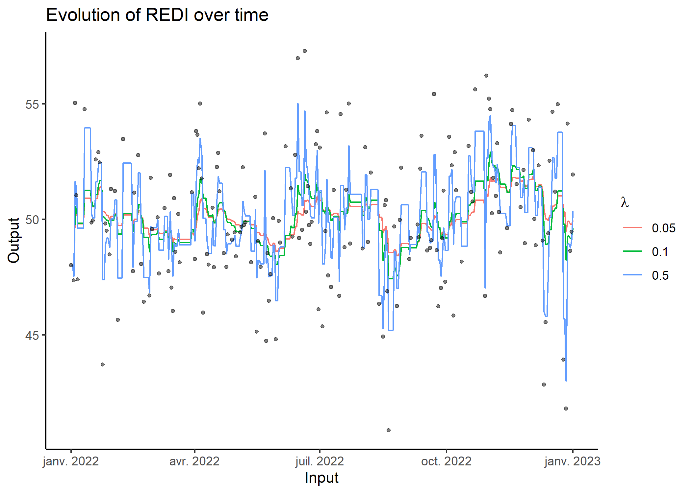

# REDI

<!-- badges: start -->
<!-- badges: end -->

The *REDI* package implements the Robust Exponential Decreasing Index
(REDI). It represents a measure of cumulated workload, is robust to
missing data and provides control of the decreasing influence of the
workload over time.

*REDI* provides various functions to format data, compute REDI and
visualise results in a simple and convenient way.

Issa Moussa, Arthur Leroy et al. (2019): Robust Exponential Decreasing
Index (REDI): adaptive and robust method for computing cumulated
workload. *BMJ Open Sport & Exercise Medicine*,
<https://bmjopensem.bmj.com/content/bmjosem/5/1/e000573.full.pdf>.

## Installation

You can install the development version of REDI from
[GitHub](https://github.com/) with:

``` r
#install.packages("devtools")
devtools::install_github("Grenouil/REDI")
```

## Example: REDI

Here is a basic example on how to simulate a dataset with the adequate
format, apply REDI on it and visualise results.

### Data simulation

``` r
library(REDI)
## Simulate a synthetic dataset, containing observations (inputs) from '2022-01-01' to '2023-01-01'. Outputs follow a gaussian distribution (mean = 50, var = 10), with a ratio of missing values equals to 0.5.

set.seed(1)
db <- simu_db(start_date = '2022-01-01',
    end_date = '2023-01-01',
    by = 'day',
    output_distrib = 'Gaussian',
    ratio_missing = 0.5,
    mean = 50,
    var = 10)
db
#> # A tibble: 366 × 2
#>    Input      Output
#>    <date>      <dbl>
#>  1 2022-01-01   48.0
#>  2 2022-01-02   NA  
#>  3 2022-01-03   47.4
#>  4 2022-01-04   55.0
#>  5 2022-01-05   51.0
#>  6 2022-01-06   47.4
#>  7 2022-01-07   NA  
#>  8 2022-01-08   NA  
#>  9 2022-01-09   NA  
#> 10 2022-01-10   NA  
#> # … with 356 more rows
```

As displayed above, any dataset processed in REDI should provide 2
columns: one corresponding to `Input` values (*i.e.* time) and another
to `Output` values (*i.e.* workload).

### Computation of REDI with wrapper function `redi()`

``` r
## Apply redi() on db and provide a vector of coefficients.
db_redi <- redi(data = db, coef = c(0.05, 0.1, 0.5), plot = TRUE)
```



**db_redi** contains 4 columns: `Input`, `Output`,`REDI` and `Lambda`.
One can provide as many values of the $\lambda$ coefficient as desired:
`redi()` displays a curve for each value of $\lambda$.

### Computation of REDI with `loop_redi()`

One can also provide a simple vector of output (workload) values instead
of a tibble with 2 columns. In this case, the output vector must be
pre-sorted by chronological order.

``` r
## Select the `Output` column of db 
workload <- db$Output

## Apply loop_redi() on workload and provide a vector of coefficients. 
redi_workload <- loop_redi(data = workload, coef = c(0.05, 0.1, 0.5))
```

`loop_redi()` computes REDI for all `Input` values with speed-up
vectorised operations. As for `redi()`, one can provide as many values
of the $\lambda$ coefficient as desired.

### Display results with `plot_redi()`

``` r
## Display results on a 2D plot, setting 'plot_data' to TRUE to visualise original data.
plot_redi(redi = db_redi,
          x_axis = 'Input',
          y_axis = 'Output',
          plot_data = TRUE)
#> Warning: Removed 549 rows containing missing values (`geom_point()`).
```


One can customize graphs by:

- changing the name of the axis by replacing the default values of
  `x_axis` and `y_axis`;
- masking the original data in black points by setting `plot_data` to
  `FALSE`.
